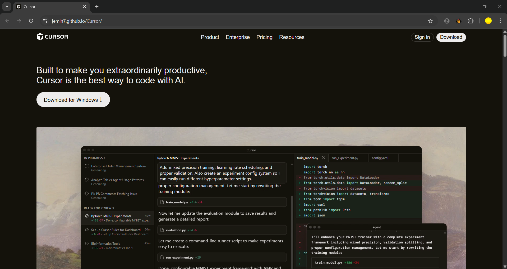
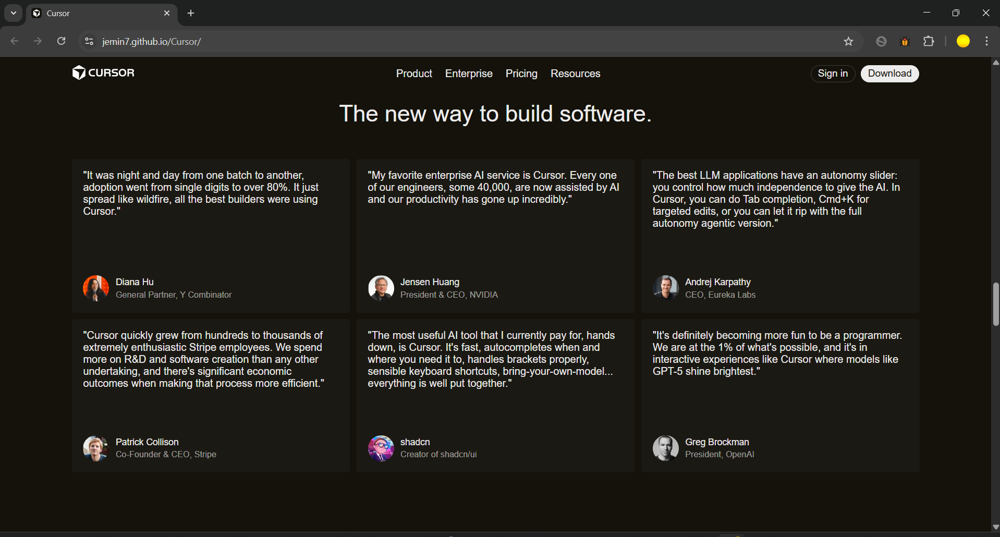
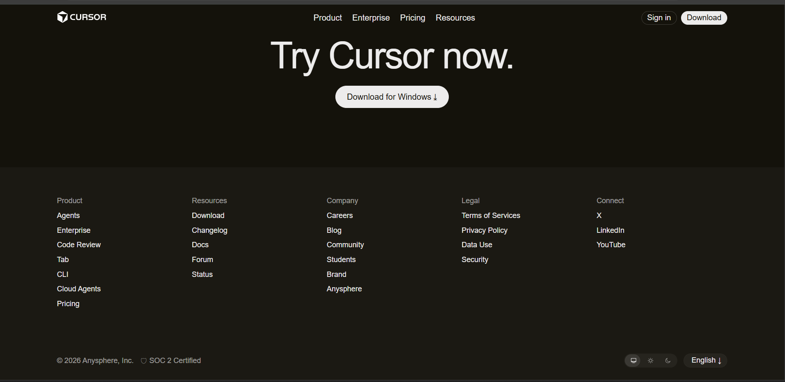
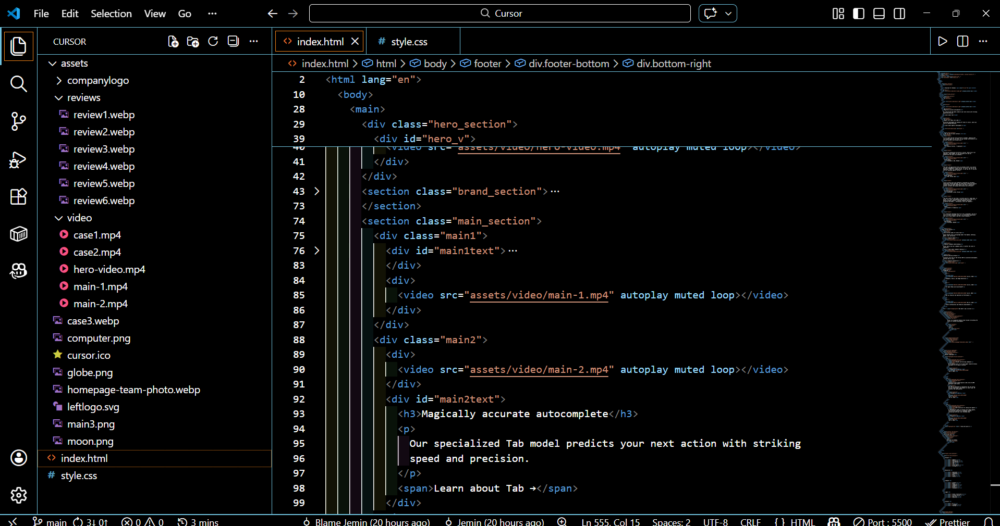
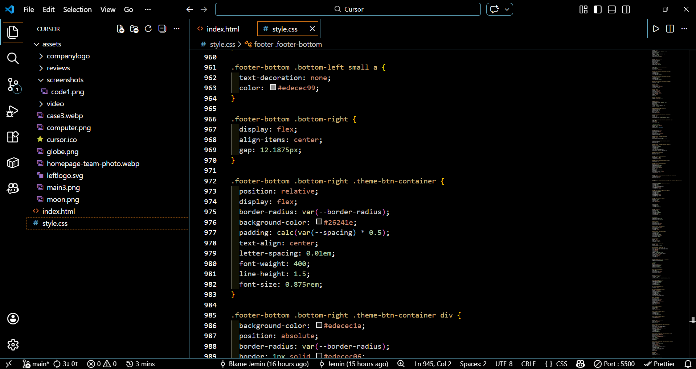

# Cursor Landing Page Clone

This project is a desktop-first recreation of the Cursor developer tool landing page, built as part of the **ChaiCode Web Development Cohort 2026** assignment.  
The goal was to achieve visual and structural accuracy, closely matching the original Cursor website in layout, typography, and hierarchy.

🔗 **Live Site:**  
https://jemin7.github.io/Cursor/

📂 **GitHub Repo:**  
https://github.com/jemin7/Cursor

## Sections Recreated

- Top Navigation Bar (dark theme)
- Hero Section with product screenshot
- Trusted By / Logos
- Feature Sections (two-column layout)
- Feature Cards Grid
- Testimonials
- Use Cases / Stories
- Changelog / Updates
- Team / About Section
- Final Call-To-Action
- Footer

## Tech Stack

- HTML5
- CSS3

## Fonts & Colors

- **Primary Font:** Inter (imported from Google Fonts) with appropriate weights for hierarchy
- **Monospace/Code Font:** System monospace fallback (e.g., 'Courier New', monospace)
- Colors and visual styling closely match the original Cursor website (dark backgrounds, white/gray text, purple/blue accents)

🔗 **Brand Assets Reference:** https://brandfetch.com/cursor.com

## Constraints Followed

- HTML & CSS only
- No JavaScript, no TailwindCSS, no animations or interactivity
- Desktop-only layout (no responsiveness required)
- Images and icons sourced/inspired from the original Cursor website and brand assets

## Project Demo

  
  
  
  
  

## Notes

This project was created strictly for learning and assignment purposes.  
All design inspiration and credit belong to Cursor.

## Author

jemin  
ChaiCode Web Development Cohort 2026 Assignment 🚀
